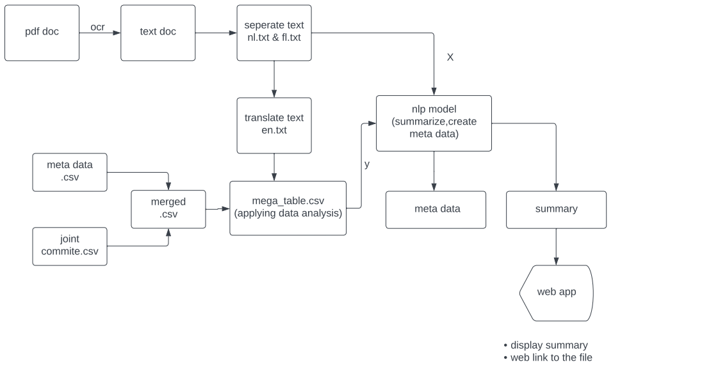

# kpmgProject


### General description

In this project we have developed a software solution which first extract info from CAO document and
then notify to the client.This project is developed for [KPMG Belgium](https://home.kpmg/be/en/home/about/overview.html), a global network of independent member firms offering audit, tax and advisory services.
Then a model is developed to predict constriction.

### Pipeline of the project




#### classification and OCR(yaya)
#### extraction of information(amanuel and maysa)


### Usage

This project is private so using the files without the consent of kpmg company is not
allowed.


### Installation

To deploy and use the project first clone it and use the deployment


1. Install virtualenv

```
pip install virtualenv
```
2. Create a virtual environment and activate it
```
virtualenv venv
> On windows -> venv\Scripts\activate
> On Linux -> . env/bin/activate

```
3. Install the necessary libraries
```
pip install -r requirements.txt
```


### Future development

* The algorithm to summarize,extract needs to be improved 
* Different models also to be tried


#### Collaborators

Developer Team
* Amanuel Zeredawit (ML Engineer)
* Maysa Abusharekh (Ml Engineer)
* Yaya Zhang (Data Enginner)

Becode coaches
* Chrysanthi
* Louis

Kpmg lighthouse
* Jonas Vanden(senior advior)
* Yasser Barona(advisor)
* Sara Silvent(advisor)


