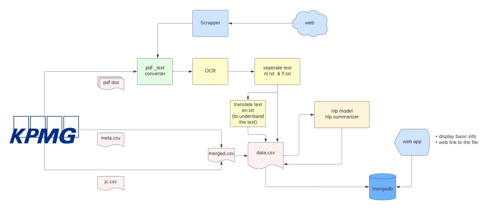

# kpmgProject


### General description

In this project we have developed a software solution which first extract info from CAO document and
then notify to the client.This project is developed for [KPMG Belgium](https://home.kpmg/be/en/home/about/overview.html), a global network of independent member firms offering audit, tax and advisory services.
Then a model is developed to predict constriction.

### Pipeline of the project




#### classification and OCR(yaya)
So our purpose is to split language and extract text from PDF. since all of PDF are coming will two type of layout, vertical and horizontal:
**step one:** we use python to read line by line, if there is one line, has more than 70 letters, then which mean, this file is vertically, we can split one page into two.
**step two:** extract PDF into text file, since most of PDF files are scaned, which mean, we need to apply OCR to extract text, we need PDFminer to extract text, then, save it to txt file.
**step three:** go through rest of files, assuming they all horizantal layout file, read line by line, if one line has more than 30 words are FR, then extract this part of paragraph.
**step four:** Since all of files are FR and NL, so Using googletrans library to translate file for our teammate to better understand the file, make ready for best model

#### Model
To predict whether a document is new or modified we use SVM. The  feature we use is
the text itself and the target is the class(new/modified).
|      model     |  score         | f1 score |
| -------------  | -------------- |----------|
| svm            |  85            | 85       |
|                |                |          |

### Summarization

we apply an NLP technique based on frequency of word count to summarize the document.
for this particular project we use spacy.


### Usage

This project is private so using the files without the consent of kpmg company is not
allowed.


### Installation

To deploy and use the project first clone it and use the deployment


1. Install virtualenv

```
pip install virtualenv
```
2. Create a virtual environment and activate it
```
virtualenv venv
> On windows -> venv\Scripts\activate
> On Linux -> . env/bin/activate

```
3. Install the necessary libraries
```
pip install -r requirements.txt
```


### Future development

* The algorithm to summarize,extract needs to be improved 
* Different models also to be tried


#### Collaborators

Developer Team
* Amanuel Zeredawit (ML Engineer)
* Maysa Abusharekh (Ml Engineer)
* Yaya Zhang (Data Enginner)

Becode coaches
* Chrysanthi
* Louis

Kpmg lighthouse
* Jonas Vanden(senior advior)
* Yasser Barona(advisor)
* Sara Silvent(advisor)


